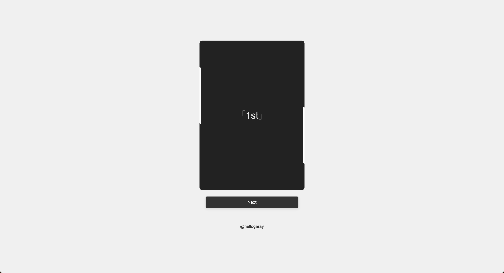
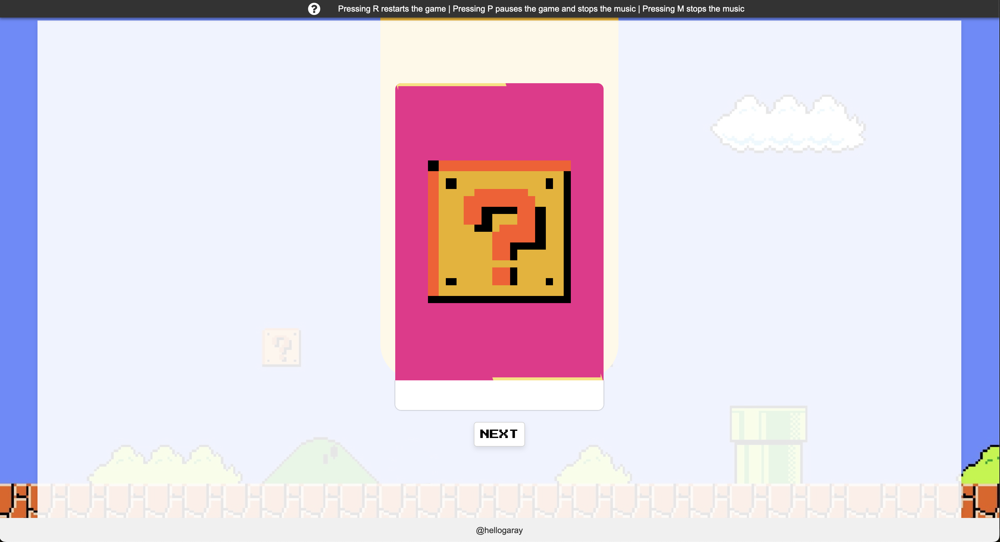

  <h1>Bowser's Big Blast</h1>
  
A fun and interactive game inspired by Bomberman

  

    
    
    
  

  
  
  

Welcome to Bowser's Big Blast! Inspired by Bowser's Big Blast game from Mario Party 2.

## Description

Through the use of cards and a randomly generated number before the big blast. This game was created to be used in English classes as an aide for learning ordinal numbers (1st, 2nd, 3rd, etc).

## Features

- Simple and intuitive gameplay.
- Randomized explosion chance for added suspense.
- Responsive design for seamless gameplay on any device.
- Engaging sound effects and animations.

## How to Play

1. Click the "Push Plunger" button to start the game.
2. Each click increases the chances of Bowser exploding.
3. If Bowser explodes, the game ends, and you'll see how many tries it took.
4. Click the plunger again to start a new game and try your luck!

## Installation

No installation is required to play Bowser's Big Blast! Simply open the provided HTML file in your web browser, and you're ready to go.

## Original Version

  

## Final Version

  

The images above show the original and final versions of the Bowser's Big Blast. The original version uses the console to get the inut from the game and the new version has it's own UI to get input and show the results.
